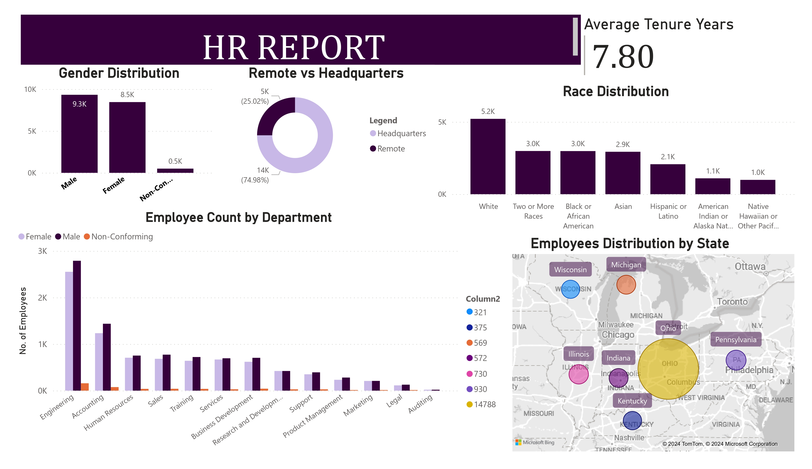

# HR-DASHBORAD-using-SQL- SQL /POWER BI

This project dives deep into the realm of data analysis using SQL and Power BI to uncover important human resource insights that can greatly benefit the company.
Featuring eye-catching dashboards offer crucial HR metrics like employee turnover, diversity, recruitment efficacy and performance evaluations. These help HR professionals 
make informed decisions and strategic workforce planning.

## Source Data:
The source data contained Human Resource 22000 records from 2000 to 2020. 

## Data Cleaning & Analysis:
This was done on SQL server 2022 involving
- Data loading & inspection
- Handling missing values
- Data cleaning and analysis

## Data Visualization:
Power BI Desktop
In a corporate setting, results can be shared online on www.powerbi.com 





## Exploratory Data Analysis
### Questions:
1)	What's the age distribution in the company?
2)	What's the gender breakdown in the company?
3)	How does gender vary across departments and job titles?
4)	What's the race distribution in the company?
5)	What's the average length of employment in the company?
6)	Which department has the highest turnover rate?
7)	What is the tenure distribution for each department?
8)	How many employees work remotely for each department?
9)	What's the distribution of employees across different states?
10)	How are job titles distributed in the company?
11)	How have employee hire counts varied over time?


### Findings:

1)Employees age <21 and 50+ years old are the fewest in the company. Most employees are 31-50 years old. And of course, the age group 31-40 have the most employees in the company.
2)	There are more male employees than female or non-conforming employees.
3)	The genders are fairly evenly distributed across departments. There are slightly more male employees overall.
4)	Whites, Africans american and  Mixed race  employees are the majority in the company, followed by Asian, Hispanic, native Americans and native hawaiian
5)	The average length of employment is 7.8 years.
6)	Auditing has the highest turnover rate, followed by Legal, Research & Development and Support ,Sales. Business Development & Marketing have the lowest turnover rates.
7)	Employees tend to stay with the company for 6-8 years. Tenure is quite evenly distributed across departments.
8)	About 25% of employees work remotely.
9)	Most employees are in Ohio (14,788) followed distantly by Pennsylvania (930) and Illinois (730), Indiana (572), Michigan (569), Kentucky (375) and Wisconsin (321).
10)	There are 182 job titles in the company, with Research Assistant II ,Business Analyst taking most of the employees (634) and Assistant Professor, Marketing Manager, Office Assistant IV, Associate Professor and VP of Training and Development taking the just 1 employee each.
11)	Employee hire counts have increased over the years but least hire count is year 2000 and highest is in 2018 .


### Data Cleaning & Analysis Using SQL :

### 1) Create Database
``` SQL
CREATE DATABASE hr;

```
### 2) Import Data to SQL Server

- Right-click on hr  > Import Data
- Use import wizard to import new_hr.csv to hr table.
- Verify that the import worked:

``` SQL
use hr;
```
``` SQL
SELECT *
FROM new_hr;
```
-Now examine the data 

``` SQL
describe new_hr ;
select * from new_hr;
```

### 3) DATA CLEANING

The termdate ,birthdate and hiredate was imported as text.  Hence it needs to be converted to the date format.


``` SQL

-- Change data types 

UPDATE new_hr SET hire_date = STR_TO_DATE(hire_date, "%d-%m-%Y");
UPDATE new_hr SET birthdate = STR_TO_DATE(birthdate, "%d-%m-%Y");

alter table new_hr 
modify hire_date date ;
alter table new_hr 
modify birthdate date ;


-- now for termdate

SELECT termdate FROM new_hr
ORDER BY termdate DESC ;

-- Step 1: Convert termdate to DATE format by removing the time part

UPDATE new_hr
SET termdate = date_format(STR_TO_DATE(LEFT(termdate, 19), '%Y-%m-%d %H:%i:%s'), '%Y-%m-%d')
WHERE termdate IS NOT NULL AND termdate != '';

-- Step 2: If necessary, alter the column type to DATE
UPDATE new_hr
SET termdate = NULL
WHERE termdate = '';

ALTER TABLE new_hr 
MODIFY COLUMN termdate DATE;

#### create new column "age"
``` SQL
ALTER TABLE hr_data
ADD age nvarchar(50)
```


#### populate new column with age
``` SQL
UPDATE hr_data
SET age = DATEDIFF(YEAR, birthdate, GETDATE());
```

## QUESTIONS TO ANSWER FROM THE DATA

#### 1) What's the age distribution in the company?

- age distribution

``` SQL
SELECT
 MIN(age) AS youngest,
 MAX(age) AS OLDEST
FROM hr_data;
```

- age group count

``` SQL
SELECT age_group,
count(*) AS count
FROM
(SELECT 
 CASE
  WHEN age <= 21 AND age <= 30 THEN '21 to 30'
  WHEN age <= 31 AND age <= 40 THEN '31 to 40'
  WHEN age <= 41 AND age <= 50 THEN '41 to 50'
  ELSE '50+'
  END AS age_group
 FROM hr_data
 WHERE new_termdate IS NULL
 ) AS subquery
GROUP BY age_group
ORDER BY age_group;
```

- Age group by gender

``` SQL
SELECT age_group,
gender,
count(*) AS count
FROM
(SELECT 
 CASE
  WHEN age <= 21 AND age <= 30 THEN '21 to 30'
  WHEN age <= 31 AND age <= 40 THEN '31 to 40'
  WHEN age <= 41 AND age <= 50 THEN '41 to 50'
  ELSE '50+'
  END AS age_group,
  gender
 FROM hr_data
 WHERE new_termdate IS NULL
 ) AS subquery
GROUP BY age_group, gender
ORDER BY age_group, gender;
```
#### 2) What's the gender breakdown in the company?

``` SQL
SELECT
 gender,
 COUNT(gender) AS count
FROM hr_data
WHERE new_termdate IS NULL
GROUP BY gender
ORDER BY gender ASC;
```

#### 3) How does gender vary across departments and job titles?

``` SQL
SELECT 
department,
gender,
count(gender) AS count
FROM hr_data
WHERE new_termdate IS NULL
GROUP BY department, gender,
ORDER BY department, gender ASC;
```
- job titles

``` SQL
SELECT 
department, jobtitle,
gender,
count(gender) AS count
FROM hr_data
WHERE new_termdate IS NULL
GROUP BY department, jobtitle, gender
ORDER BY department, jobtitle, gender ASC;
```

#### 4) What's the race distribution in the company?

``` SQL
SELECT
race,
count(*) AS count
FROM
hr_data
WHERE new_termdate IS NULL 
GROUP BY race
ORDER BY count DESC;
```

#### 5) What's the average length of employment in the company?

``` SQL
SELECT 
AVG(DATEDIFF(year, hire_date, new_termdate)) AS tenure
FROM hr_data
WHERE new_termdate IS NOT NULL AND new_termdate <= GETDATE();

```

#### 6) Which department has the highest turnover rate?
- get total count
- get terminated count
- terminated count/total count

``` SQL
SELECT
 department,
 total_count,
 terminated_count,
 (round((CAST(terminated_count AS FLOAT)/total_count), 2)) * 100 AS turnover_rate
 FROM
	(SELECT 
	 department,
	 count(*) AS total_count,
	 SUM(CASE
		WHEN new_termdate IS NOT NULL AND new_termdate <= GETDATE() THEN 1 ELSE 0
		END
		) AS terminated_count
	FROM hr_data
	GROUP BY department
	) AS subquery
ORDER BY turnover_rate DESC;
```

#### 7) What is the tenure distribution for each department?

``` SQL
SELECT 
    department,
    AVG(DATEDIFF(year, hire_date, new_termdate)) AS tenure
FROM 
    hr_data
WHERE 
    new_termdate IS NOT NULL 
    AND new_termdate <= GETDATE()
GROUP BY 
    department;

```


#### 8) How many employees work remotely for each department?

``` SQL
SELECT
 location,
 count(*) as count
FROM hr_data
WHERE new_termdate IS NULL
GROUP BY location;
```

#### 9) What's the distribution of employees across different states?

``` SQL
SELECT 
 location_state,
 count(*) AS count
FROM hr_data
WHERE new_termdate IS NULL
GROUP BY location_state
ORDER BY count DESC;
```

#### 10) How are job titles distributed in the company?

``` SQL
SELECT 
 jobtitle,
 count(*) AS count
 FROM hr_data
 WHERE new_termdate IS NULL
 GROUP BY jobtitle
 ORDER BY count DESC;
```

#### 11) How have employee hire counts varied over time?
- calculate hires
- calculate terminations
- (hires-terminations)/hires percent hire change

``` SQL
SELECT
 hire_year,
 hires,
 terminations,
 hires - terminations AS net_change,
 (round(CAST(hires-terminations AS FLOAT)/hires, 2)) * 100 AS percent_hire_change
 FROM
	(SELECT 
	 YEAR(hire_date) AS hire_year,
	 count(*) AS hires,
	 SUM(CASE
			WHEN new_termdate is not null and new_termdate <= GETDATE() THEN 1 ELSE 0
			END
			) AS terminations
	FROM hr_data
	GROUP BY YEAR(hire_date)
	) AS subquery
ORDER BY percent_hire_change ASC;
```


